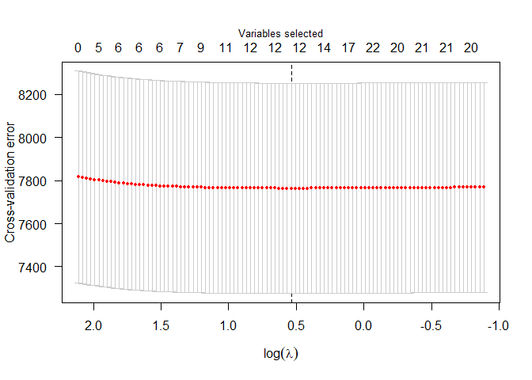

`OpenCancer` package installation might fail when `CARET` is not already installed in the computer. As it is stated in [CARET documentation](https://cran.r-project.org/web/packages/caret/vignettes/caret.pdf), to install it, you should run


```r
install.packages("caret", dependencies = c("Depends", "Suggests"))
```

which might be quite long. Once `CARET` installed, you can run


```r
install.packages("devtools")
devtools::install_github("linogaliana/OpenCancer")
```

`OpenCancer` package has been designed to help anyone wanting to work on cancer data to build a dataset. As an example, we use colon cancer data. However, functions are general enough to be applied to any similar data. One of the main challenges of the `Epidemium` dataset is that it requires high-dimensional statistical techniques. `OpenCancer` package allows to

* Easily import and merge [Epidemium](http://qa.epidemium.cc/data/epidemiology_dataset/) datasets
* Build a clean training table
* Perform feature selection
* Apply statistical models on selected features

Vignettes have been written to help any users working with `OpenCancer` and can be accessed using `browseVignettes("OpenCancer")`

* [Import Epidemium data and build training table](/vignettes/import_data.Rmd). HTML version can be found [here](http://htmlpreview.github.io/?https://github.com/linogaliana/OpenCancer/blob/master/vignettes/import_data.html)
* [Use pointers to build statistical models](/vignettes/estimation_pointers.Rmd). HTML version can be found [here](http://htmlpreview.github.io/?https://github.com/linogaliana/OpenCancer/blob/master/vignettes/estimation_pointers.html)

If you want to see this `README` with the code output in HTML, go [there](http://htmlpreview.github.io/?https://github.com/linogaliana/OpenCancer/blob/master/README.html)

It might be hard to work with Epidemium data because they require lots of RAM when working with R. It is a challenge to take advantage of the statistical power of R packages without being limited by the R memory handling system. Many functions of the `OpenCancer`, relying on the `bigmemory` package, implement memory efficient techniques based on C++ pointer.

`OpenCancer` package has been designed such that it is possible to work with pointers (`big.*` functions) or apply equivalent functions when working with standard dataframes (same functions names without `big.*` prefix). In this tutorial, we will use pointers since it is less standard and might require some explanations.

# Importing Epidemium data using pointers

You can find [here](/vignettes/import_data.Rmd) a `Vignette` describing how to create the clean training table stored as a `csv`. After installing `OpenCancer` package, we import training data using pointers


```r
library(OpenCancer)
datadir <- paste0(getwd(),"/vignettes/inst")

X <- bigmemory::read.big.matrix(paste0(datadir,"/exampledf.csv"), header = TRUE)
```

This `markdown` presents a standard methodology :

* Feature selection using LASSO
* Linear regression on selected features

`Epidemium` data are multi-level panel data. An individual unit is defined by a series of variables that are overlapping levels (country, region, sex, age levels and sometimes ethnicity). `OpenCancer` functions allow to apply this methodology on groups that are defined independently by a series of variables. Some function executions can be parallelized. The main interest of using pointers rather than dataframes is that data are never imported in memory, avoiding to sature computer's RAM. 


# Feature selection

Feature selection is performed using LASSO. Given a penalization parameter $\lambda$ and a set of $p$ explanatory variables, we want to solve the following program 
$$\widehat{\beta}\in\arg\min_{\beta\ \in\mathbb{R}^p}\ \frac{1}{2}\ \left|\right|y-X\beta\left|\right|_2^2 + \lambda ||\beta||_1 $$
using standard matrix notations. The $\lambda$ parameter is of particular importance. Its value determines the sparsity of the model: the higher $\lambda$ is, the stronger the $\ell_1$ constraint is and the more $\beta$ coefficients will be zero.

The optimal set of parameters can be selected using cross validation (`OpenCancer` package also allows not to perform cross validation but is not recommended).

`big.simplelasso` has been designed to perform LASSO using `biglasso` package (for the non-pointers version, `simplelasso` the `glmnetUtils` is used). Assume we want to use a pooled model, i.e. we do not define independent groups. In that case, the following command can be used


```r
lassomodel <- big.simplelasso(X,yvar = 'incidence', labelvar = c("cancer", "age", "sex",
  "Country_Transco", "year"),
  crossvalidation = T,
  nfolds = 10, returnplot = F)
```

where we excluded a few variables - that are labelling variables, not explanatory - from the set of covariates. The `returnplot` option, when it is set to `TRUE` will produce the following plot


```r
plot(lassomodel$model)
```

<!-- -->

The LASSO performance is the following


```r
summary(lassomodel$model)
```

```
## lasso-penalized linear regression with n=5928, p=8185
## At minimum cross-validation error (lambda=1.7106):
## -------------------------------------------------
##   Nonzero coefficients: 12
##   Cross-validation error (deviance): 7764.17
##   R-squared: 0.01
##   Signal-to-noise ratio: 0.01
##   Scale estimate (sigma): 88.115
```

In that case, we see that from 1420 variables, LASSO selects 13 variables (13 variables and a constant). If parallelization is wanted, assuming one core is let aside of computations,


```r
big.simplelasso(X,yvar = 'incidence', labelvar = c("cancer", "age", "sex",
  "Country_Transco", "year", "area.x", "area.y"), crossvalidation = T,
  nfolds = 10, returnplot = F,
  ncores = parallel::detectCores() - 1)
```

# Linear regression after feature selection

`big.simplelasso` is useful to select features. To go further, we can perform linear regression on selected variables. The `big.model.FElasso` allows to launch a `big.simplelasso` routine, extract non-zero coefficients and use, afterwards, linear regression. 


```r
pooledOLS <- big.model.FElasso(X,yvar = "incidence",
                           labelvar = c("cancer", "age",
  "Country_Transco", "year", "area.x", "area.y"),
  returnplot = F, groupingvar = NULL)

summary(pooledOLS)
```

```
## Large data regression model: biglm(formula = formula, data = data, ...)
## Sample size =  5928 
##                   Coef      (95%      CI)       SE      p
## (Intercept)   -16.7001 -707.5712 674.1711 345.4356 0.9614
## sex             4.7179    0.1425   9.2934   2.2877 0.0392
## `6741..72040`  -4.1941 -281.4209 273.0326 138.6134 0.9759
## `6690..5110`   -0.0001   -0.0290   0.0288   0.0145 0.9960
## `1057..5112`    0.0000   -0.0004   0.0004   0.0002 0.9917
## `372..5510`     0.0000   -0.0004   0.0004   0.0002 0.9994
## `2600..5510`    0.0000   -0.0001   0.0001   0.0001 0.9671
## `1062..5510`    0.0000   -0.0002   0.0002   0.0001 0.9679
## `358..5312`     0.0002   -0.0128   0.0131   0.0065 0.9805
## `1780..5510`    0.0000   -0.0005   0.0005   0.0002 0.9577
## `51..5510`      0.0000    0.0000   0.0000   0.0000 0.9848
## `882..5510`     0.0000   -0.0005   0.0005   0.0002 0.9589
## `1765..5510`        NA        NA       NA       NA     NA
## `2738..5510`        NA        NA       NA       NA     NA
## `1770..5510`        NA        NA       NA       NA     NA
```


```r
DTsummary.biglm(pooledOLS)$coefftab
```

<!--html_preserve--><div id="htmlwidget-f1a66457db323737e0da" style="width:100%;height:auto;" class="datatables html-widget"></div>
<script type="application/json" data-for="htmlwidget-f1a66457db323737e0da">{"x":{"filter":"none","data":[["(Intercept)","sex","`6741..72040`","`6690..5110`","`1057..5112`","`372..5510`","`2600..5510`","`1062..5510`","`358..5312`","`1780..5510`","`51..5510`","`882..5510`"],[-16.7000756212345,4.71794871794853,-4.19414422307722,-7.32994420940235e-005,-1.96473635908129e-006,-1.4092582644247e-007,2.64580153249078e-006,3.31750687581901e-006,0.00015822992639045,1.28022710888186e-005,-2.7650416442506e-007,-1.24681739194139e-005],[345.435576289502,2.28774331833179,138.613367611788,0.0144514347879613,0.000188002785622397,0.00019387702476103,6.40564505680101e-005,8.23670518557774e-005,0.00648643599197591,0.000241315484952422,1.4492563231375e-005,0.00024175450152368],[-0.0483449788253383,2.06227188170255,-0.0302578625376427,-0.00507212212278641,-0.0104505704666922,-0.000726882551535816,0.0413042169684641,0.0402771108237294,0.0243939702151057,0.053052008209679,-0.0190790379873213,-0.0515736991072849],[0.961442941274732,0.0392254447342501,0.975862423170411,0.995953220523254,0.991662155503421,0.999420056206074,0.967054765814296,0.967873561678552,0.980539181109122,0.957692261615281,0.984778697372087,0.958870118590502],["","*","","","","","","","","","",""]],"container":"<table class=\"hover\">\n  <thead>\n    <tr>\n      <th>Coefficient<\/th>\n      <th>Estimate<\/th>\n      <th>Std. Error<\/th>\n      <th>Student t-stat<\/th>\n      <th>Pr(&gt;|t|)<\/th>\n      <th><\/th>\n    <\/tr>\n  <\/thead>\n<\/table>","options":{"pageLength":20,"crosstalkOptions":{"key":null,"group":null},"columnDefs":[{"className":"dt-right","targets":[1,2,3,4]}],"order":[],"autoWidth":false,"orderClasses":false,"lengthMenu":[10,20,25,50,100],"rowCallback":"function(row, data) {\nDTWidget.formatRound(this, row, data, 4, 3, 3, ',', '.');\nDTWidget.formatRound(this, row, data, 3, 1, 3, ',', '.');\nDTWidget.formatRound(this, row, data, 2, 2, 3, ',', '.');\nDTWidget.formatRound(this, row, data, 1, 4, 3, ',', '.');\n}"},"selection":{"mode":"multiple","selected":null,"target":"row"}},"evals":["options.rowCallback"],"jsHooks":[]}</script><!--/html_preserve-->

```r
DTsummary.biglm(pooledOLS)$modeltab
```

<!--html_preserve--><div id="htmlwidget-3b9d710516a393444d10" style="width:100%;height:auto;" class="datatables html-widget"></div>
<script type="application/json" data-for="htmlwidget-3b9d710516a393444d10">{"x":{"filter":"none","data":[["Nombre Observations","Nombre Paramètres","R2","R2 ajusté","F-stat","Degré Liberté"],[5928,15,0.0745471711851782,0.0721991007467103,34.021755890223,5913]],"container":"<table class=\"hover\">\n  <thead>\n    <tr>\n      <th>Statistique<\/th>\n      <th>Valeur<\/th>\n    <\/tr>\n  <\/thead>\n<\/table>","options":{"pageLength":20,"crosstalkOptions":{"key":null,"group":null},"columnDefs":[{"className":"dt-right","targets":1}],"order":[],"autoWidth":false,"orderClasses":false,"lengthMenu":[10,20,25,50,100],"rowCallback":"function(row, data) {\nDTWidget.formatRound(this, row, data, 1, 3, 3, ',', '.');\n}"},"selection":{"mode":"multiple","selected":null,"target":"row"}},"evals":["options.rowCallback"],"jsHooks":[]}</script><!--/html_preserve-->

# Apply same methodology with independent groups

`big.model.FElasso` allows to apply the same methodology with dataframes splitted by groups. 
For instance, defining independent groups by sex and age class


```r
panelOLS <- big.model.FElasso(X,yvar = "incidence",
                              groupingvar = c('sex','age'),
                              labelvar = c('year','Country_Transco')
)

DTsummary.biglm(panelOLS[[2]])
```

# Importing data after feature selection

Once features have been selected, using pointers is no longer so relevant since the dataset with a few columns not being so large. It is thus possible, once features have been selected, to import data with selected features back in the memory. `recover_data` has been designed for that. Taking a pointer as input, it performs LASSO to select feature and imports relevant variables back in the memory as a `tibble`. 


```r
df <- unique(recover_data(X))
DT::datatable(df[sample.int(nrow(df),10),1:7])
```

<!--html_preserve--><div id="htmlwidget-19274dffb3a0a0f07477" style="width:100%;height:auto;" class="datatables html-widget"></div>
<script type="application/json" data-for="htmlwidget-19274dffb3a0a0f07477">{"x":{"filter":"none","data":[["1","2","3","4","5","6","7","8","9","10"],[1,2,1,1,2,1,1,1,1,1],[18,6,13,17,12,13,19,12,11,12],[19,19,19,19,19,19,19,6,19,19],[1982,1975,1982,1982,1980,1979,1977,1982,1978,1981],[15,9,33,19,32,298,5,2,3,0],[1072000,886800,1072000,1072000,1053000,1060000,954000,187000,1001000,1078000],[4123000,3812900,4123000,4123000,4126100,4083300,3811500,950000,3962300,4139200]],"container":"<table class=\"display\">\n  <thead>\n    <tr>\n      <th> <\/th>\n      <th>sex<\/th>\n      <th>age<\/th>\n      <th>Country_Transco<\/th>\n      <th>year<\/th>\n      <th>incidence<\/th>\n      <th>1057..5112<\/th>\n      <th>1062..5510<\/th>\n    <\/tr>\n  <\/thead>\n<\/table>","options":{"crosstalkOptions":{"key":null,"group":null},"columnDefs":[{"className":"dt-right","targets":[1,2,3,4,5,6,7]},{"orderable":false,"targets":0}],"order":[],"autoWidth":false,"orderClasses":false},"selection":{"mode":"multiple","selected":null,"target":"row"}},"evals":[],"jsHooks":[]}</script><!--/html_preserve-->

It is henceforth possible to use standard statistical and visualization tools. For instance, assume we want to perform random forest using `CARET`


```r
train.index <- sample.int(n = nrow(df), size = 0.8*nrow(df))
trainData <- df[train.index,-which(colnames(df) == "year")]
testData  <- df[-train.index,-which(colnames(df) == "year")]

rfctrl <- trainControl(method = "cv", number = 5)
randomforest <- caret::train(incidence ~ ., data = trainData,
                             trControl = rfctrl, method = "rf")

knitr::kable(data.frame(yhat = predict(randomforest,testData),
                        y = testData$incidence)[1:10,])
```
